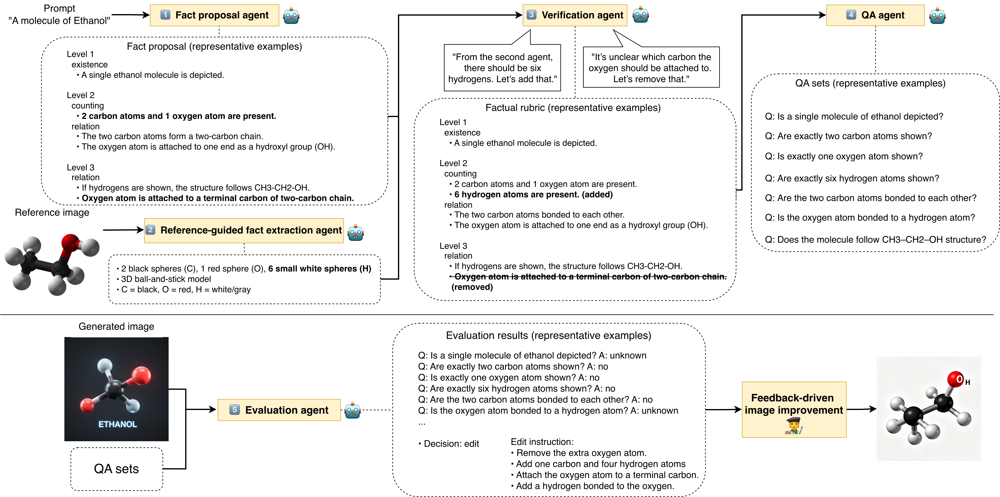

# FAGER: Factually Grounded Evaluation and Refinement of Text-to-Image Models

[](LICENSE)
[](https://www.python.org/)

> A factuality-aware evaluation and iterative refinement pipeline for text-to-image generation.

---

## Abstract

<!-- TODO: paste abstract from paper -->

---

## Pipeline



---

## Key Contributions

- **Structured factual rubric construction** — an LLM agent extracts visually verifiable factual requirements from any text prompt, organized into a three-level taxonomy (coarse → fine-grained).
- **Three-level evaluation taxonomy** — Level 1 (coarse identity), Level 2 (key attributes and brand/model details), Level 3 (fine-grained details and inscriptions), each weighted by importance.
- **Factual A/B test** — a pairwise accuracy metric that compares real and generated images under the same rubric, providing a calibrated measure of factual fidelity.
- **Iterative refinement pipeline** — the evaluator emits structured `keep / edit / regenerate` decisions with actionable constraints, feeding downstream FLUX or Qwen-based image editors.

---

## Installation

```bash
git clone https://github.com/TODO/FAGER.git
cd FAGER
python -m venv .venv && source .venv/bin/activate
pip install -r requirements.txt
cp .env.example .env   # fill in OPENAI_API_KEY and other keys
```

> **GPU note:** Steps 2 and 5-Qwen use local Qwen3-VL models and require approximately 16 GB of VRAM. The OpenAI and Gemini evaluator variants (steps 5-openai and 5-gemini) run on CPU via API.

---

## Data Setup

Reference images are not committed to this repository. Download them before running the pipeline.

**ABO dataset** (automated, Apache-licensed S3 bucket):
```bash
python scripts/download_reference_images.py --dataset ABO
```

**Culture dataset** (interactive — manual image selection required due to licensing):
```bash
python scripts/download_reference_images.py --dataset culture
```
The culture script prints a Google Images search URL for each prompt and asks you to paste a direct image URL. See `data/culture/selected_images_manifest.csv` for the expected filenames and SHA-256 checksums.

Add `--dry-run` to either command to preview what would be downloaded without downloading.

---

## Quickstart

Run the full pipeline on the ABO benchmark:

```bash
bash scripts/reproduce.sh
```

See `scripts/reproduce.sh` for the exact CLI invocations for each step and comments explaining what each step does. Set `OPENAI_MODEL` to override the default model:

```bash
OPENAI_MODEL=gpt-4o bash scripts/reproduce.sh
```

---

## Pipeline Stages

### Step 1 — Fact Proposal (`fager/step1_fact_proposal.py`)

Calls an OpenAI reasoning model to extract a structured factual rubric from each text prompt. The rubric organizes facts into a 3-level × 9-category JSON schema with per-category importance scores.

```bash
python fager/step1_fact_proposal.py \
  --in_csv  data/ABO/prompts.csv \
  --out_csv runs/step1_proposals.csv \
  --model   gpt-4o \
  --reasoning_effort high
```

### Step 2 — VLM Fact Extraction (`fager/step2_vlm_extraction.py`)

Uses a local Qwen3-VL model to extract visual facts from reference images (one per prompt). The output is used to ground and calibrate the rubric in step 3.

```bash
python fager/step2_vlm_extraction.py \
  --in_csv    data/ABO/prompts.csv \
  --out_jsonl runs/step2_vlm.jsonl \
  --image_dir data/ABO/selected_images
```

`fager/step2_vlm_t2ifb.py` is an alternative extraction script adapted for the T2I-FactualBench format. `fager/step2_verification.py` is a Wikipedia-backed verification variant used for the culture domain.

### Step 3 — Fact Verification (`fager/step3_verification.py`)

An LLM agent cross-checks the proposed rubric against visual evidence from step 2, dropping facts that are not visually verifiable and adding identity-defining facts that were missing.

```bash
python fager/step3_verification.py \
  --in_agent1 runs/step1_proposals.csv \
  --in_agent2 runs/step2_vlm.jsonl \
  --out_jsonl runs/step3_verified.jsonl \
  --model     gpt-4o \
  --resume
```

### Step 4 — QA Generation (`fager/step4_qa_generation.py`)

Converts each fact in the verified rubric into an atomic yes/no/unknown question. The resulting QA CSV is the evaluation instrument used in step 5.

```bash
python fager/step4_qa_generation.py \
  --in_jsonl  runs/step3_verified.jsonl \
  --out_csv   runs/step4_QA.csv \
  --model     gpt-4o
```

The pre-generated QA benchmarks for ABO and culture are in `data/ABO/QA.csv` and `data/culture/QA.csv`.

### Step 5 — MLLM Evaluation

A multimodal LLM answers each question in the QA CSV using only visual evidence from the generated image. Scoring: yes = 1, no = 0, unknown = 0.5. The evaluator gates on Level 1 score before evaluating Levels 2 and 3, and emits a `keep / edit / regenerate` decision per image.

Three evaluator backends are provided:

| Script | Backend | Notes |
|---|---|---|
| `fager/step5_eval_openai.py` | OpenAI API | recommended; requires `OPENAI_API_KEY` |
| `fager/step5_eval_gemini.py` | Google Gemini API | requires `GOOGLE_API_KEY` |
| `fager/step5_eval_qwen.py` | Local Qwen3-VL | requires ~16 GB VRAM |

```bash
python fager/step5_eval_openai.py \
  --qa_csv    data/ABO/QA.csv \
  --image_dir /path/to/generated_images \
  --out_dir   runs/step5_eval \
  --model     gpt-4o
```

Outputs: `summary.csv` (one row per image) and `details.jsonl` (per-question answers).

### Step 6 — Image Refinement (`imgGen/`)

Uses the `edit / regenerate` decisions from step 5 to iteratively improve generated images.

```bash
# FLUX.1-dev (regenerate) + FLUX.1-Kontext-dev (edit)
python imgGen/run_flux.py \
  --summary_csv runs/step5_eval/summary.csv \
  --image_dir   /path/to/generated_images \
  --out_dir     runs/step6_refined

# Qwen image editing backend
python imgGen/run_qwen_edit.py \
  --summary_csv runs/step5_eval/summary.csv \
  --image_dir   /path/to/generated_images \
  --out_dir     runs/step6_refined
```

Both scripts require a Hugging Face login (`huggingface-cli login` or `HF_TOKEN` in `.env`) for the gated FLUX model repositories.

---

## Evaluation

### Final score

```bash
python fager/final_score.py --csv runs/step5_eval/summary.csv
```

### Pairwise accuracy (Factual A/B test)

Compares two `summary.csv` files (e.g., real images vs. generated images) and reports the fraction of prompts where the real image scores higher.

```bash
python evaluate/pairwise_accuracy.py \
  --real_csv data/ABO/results/real/summary.csv \
  --fake_csv runs/step5_eval/summary.csv \
  --scores   overall_score,level_1_score,level_2_score,level_3_score
```

To reproduce the pairwise accuracy numbers in the paper, use the pre-computed results in `data/ABO/results/` and `data/culture/results/` as the `--real_csv` baseline and run your generated images through step 5 to produce the `--fake_csv`. See Table 1 and Table 2 of the paper for the reported scores.

---

## Datasets

| Dataset | Domain | Prompts | Source |
|---|---|---|---|
| ABO (ours) | Amazon product images | 50 | [Amazon Berkeley Objects](https://amazon-berkeley-objects.s3.amazonaws.com/index.html) |
| Culture (ours) | Cultural knowledge | 30 | Manually curated |
| I-HallA-Science | Scientific diagrams | 99 | [I-HallA benchmark](https://github.com/kaist-cvml/I-HallA-v1.0) |
| I-HallA-History | Historical knowledge | 99 | [I-HallA benchmark](https://github.com/kaist-cvml/I-HallA-v1.0) |
| T2I-FactualBench-SKCM | Factual generation | 100 | [T2I-FactualBench](https://github.com/Safeoffellow/T2I-FactualBench) |

The ABO and Culture QA benchmarks (`data/{ABO,culture}/QA.csv`) were generated by running the full FAGER pipeline (steps 1–4) on the corresponding prompt lists. They can be used as drop-in evaluation sets for any text-to-image model.

---

## License

The FAGER code is released under the [MIT License](LICENSE).

Downloaded reference images retain their original licenses:
- ABO images: [Amazon Berkeley Objects license](https://amazon-berkeley-objects.s3.amazonaws.com/index.html) (Apache 2.0)
- Culture images: sourced manually; users are responsible for verifying the license of each image they select

---

## Citation

```bibtex
@inproceedings{lim2026fager,
  title     = {{FAGER}: Factually Grounded Evaluation and Refinement of Text-to-Image Models},
  author    = {Lim, Youngsun and Ham, Cusuh and Chen, Pin-Yu and Ghadiyaram, Deepti},
  booktitle = {Proceedings of the IEEE/CVF Conference on Computer Vision and Pattern Recognition (CVPR) Workshops},
  year      = {2026},
}
```

---
